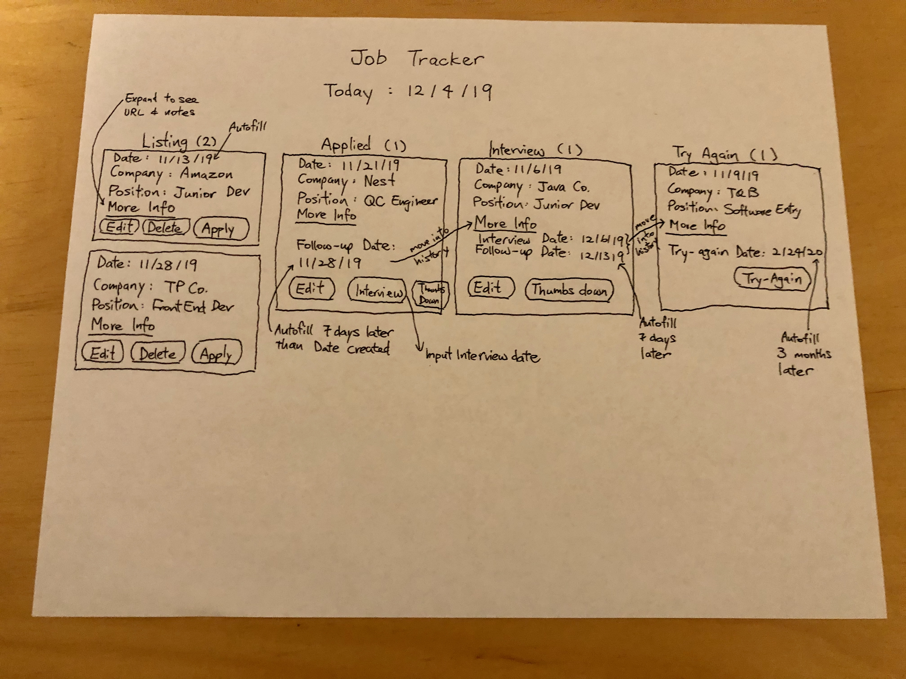
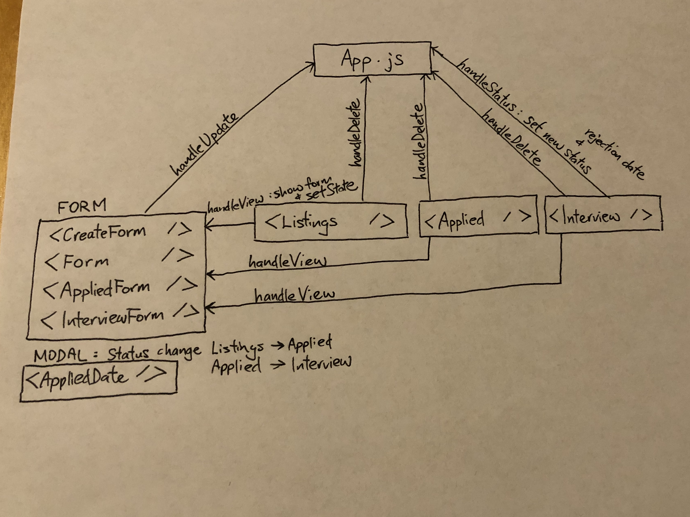

# Job Tracker
A tracking application for job seekers, built by software engineering students Wincy Law and Becca King
[Live site]
(http://job-tracker-phpreact.herokuapp.com/job_tracker/build/index.html)

## Technologies Used
* PHP
* SQL
* React
* Heroku

## WireFraming



## App.js JSX structure
```html
1  <div className = "container">
2  
3      <header></header>
4
5      <div className = "addForm">
6         {this.state.view ? <Different Form /> : null}
7      </div>
8     
9      <div className = "box-container">
10         <Listings />
11         <Applied />
12         <Interview />
13         <TryAgain />
14     </div>
15
16  </div>
```
## Code Structure


After using an npm run build command, we are able to create the files necessary to host the fully integrated site at the link listed above, but only after using a search and replace function to redirect all scripts in job_tracker/job_tracker/build/index.html that start with /static to instead start with job_tracker/build/static. Every time the site is updated, the npm run build command and script adjustments must be performed again.
